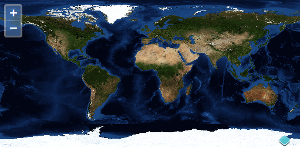

# Créez une carte

Dans OpenLayers, une carte est une collection de couches avec plusieurs `interactions` et `controls` pour gérer les interactions utilisateurs. Une carte est générée avec trois ingrédients basiques: les balises, les déclarations de style et l'initialisation du code.

## Exemple fonctionnel

Jetons un oeil à un exemple pleinement fonctionnel d'une carte OpenLayers 3.

```html
<!doctype html>
<html lang="en">
  <head>
    <link rel="stylesheet" href="/ol.css" type="text/css">
    <style>
      #map {
        height: 256px;
        width: 512px;
      }
    </style>
    <title>OpenLayers 3 example</title>
    <script src="/loader.js" type="text/javascript"></script>
  </head>
  <body>
    <h1>My Map</h1>
    <div id="map"></div>
    <script type="text/javascript">
      var map = new ol.Map({
        target: 'map',
        layers: [
          new ol.layer.Tile({
            title: 'Global Imagery',
            source: new ol.source.TileWMS({
              url: 'http://demo.opengeo.org/geoserver/wms',
              params: {LAYERS: 'nasa:bluemarble', VERSION: '1.1.1'}
            })
          })
        ],
        view: new ol.View({
          projection: 'EPSG:4326',
          center: [0, 0],
          zoom: 0,
          maxResolution: 0.703125
        })
      });
    </script>
  </body>
</html>
```

### Tâches

1.  Assurez-vous d'avoir bien complété les [instructions de configuration](../) pour installer les dépendances et avoir le serveur de debug qui fonctionne.

1.  Copiez le texte ci-dessus dans un nouveau fichier appelé `map.html`, et sauvez-le à la racine du répertoire du workshop.

1.  Ouvrir la carte dans votre navigateur web: {{ book.workshopUrl }}/map.html



Après avoir créé avec succès votre première carte, nous allons continuer en regardant plus précisément chacune des [différentes parties](./dissect.md).
