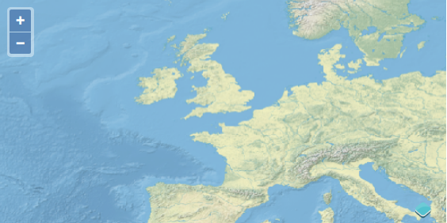
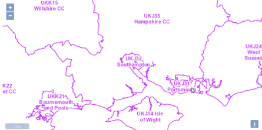

# Couches "Web Map Service" (WMS)

Quand vous ajoutez une couche à votre carte, la source de la couche est responsable typiquement d'appeler la donnée qui doit être affichée. La donnée demandée peut être soit raster, soit vecteur. Vous pouvez assimiler une donnée raster comme une information rendue comme une image côté serveur. La donnée vecteur est délivrée comme une information structurée depuis le serveur et peut potentiellement être calculée pour l'affichage via le client (votre navigateur).

Il y a  de nombreux types de services qui fournissent des données cartographiques raster. Cette section traite des fournisseurs qui se conforment à la spécification [Web Map Service (WMS)](http://www.opengeospatial.org/standards/wms) de l'OGC (Open Geospatial Consortium, Inc.).

## Créer une couche

Nous allons commencer avec un exemple complet de carte et modifier les couches pour pour avoir la compréhension de comment elles fonctionnent.

Jetez un oeil au code suivant:

```html
<!doctype html>
<html lang="en">
  <head>
    <link rel="stylesheet" href="/ol.css" type="text/css">
    <style>
      #map {
        height: 256px;
        width: 512px;
      }
    </style>
    <script src="/loader.js" type="text/javascript"></script>
    <title>OpenLayers 3 example</title>
  </head>
  <body>
    <h1>My Map</h1>
    <div id="map"></div>
    <script type="text/javascript">
      var map = new ol.Map({
        target: 'map',
        layers: [
          new ol.layer.Tile({
            title: 'Global Imagery',
            source: new ol.source.TileWMS({
              url: 'http://demo.opengeo.org/geoserver/wms',
              params: {LAYERS: 'nasa:bluemarble', VERSION: '1.1.1'}
            })
          })
        ],
        view: new ol.View({
          projection: 'EPSG:4326',
          center: [0, 0],
          zoom: 0,
          maxResolution: 0.703125
        })
      });
    </script>
  </body>
</html>
```

### Tâches

1. Si vous ne l'avez pas déjà fait, sauvez le texte ci-dessus comme `map.html` à la racine de votre répertoire workshop.

1. Ouvrez la page dans votre navigateur pour confirmer que les choses fonctionnent: {{ book.workshopUrl }}/map.html

## Le constructeur `ol.layer.Tile`

Le constructeur `ol.layer.Tile` nécessite un objet littéral de type `olx.layer.TileOptions` voir: http://openlayers.org/en/master/apidoc/ol.layer.Tile.html
Dans ce cas, nous complétons la clé `source` des options avec une `ol.source.TileWMS`.
Un titre lisible par les humains pour la couche peut être fournie avec la clé `title`, mais n'importe quel nom pour la clé peut être utilisée ici.
Dans OpenLayers 3, il y a une séparation entre les couches et les sources alors que dans Openlayers 2, l'ensemble faisait partie d'une couche.

`ol.layer.Tile` représente un grille régulière d'images, `ol.layer.Image` représente une image seule. En fonction du type de couche, vous devrez ajouter une source différente (`ol.source.TileWMS` versus `ol.source.ImageWMS`) également.

## Le constructeur `ol.source.TileWMS`

Le constructeur `ol.source.TileWMS` est un argument unique qui est définit par: http://openlayers.org/en/master/apidoc/ol.source.TileWMS.html.
L'url est la `online resource` du service WMS, et `params` est un objet litéral avec les noms des paramètres et leurs valeurs. Depuis que la version par défaut du WMS est la version 1.3.0 dans OpenLayers, vous pourriez avoir besoin de renseigner une version inférieure dans les `params` si votre WMS ne supporte par le WMS 1.3.0.

```js
  layers: [
    new ol.layer.Tile({
      title: 'Global Imagery',
      source: new ol.source.TileWMS({
        url: 'http://demo.opengeo.org/geoserver/wms',
        params: {LAYERS: 'nasa:bluemarble', VERSION: '1.1.1'}
      })
    })
  ]
```

### Tâches

1. Ce même WMS offre une couche [Natural Earth](http://www.naturalearthdata.com/) nommée `'ne:NE1_HR_LC_SR_W_DR'`. Changez la valeur du paramètre `LAYERS` de `'nasa:bluemarble'` à `'ne:NE1_HR_LC_SR_W_DR'`.

  Votre version mise à jour du constructeur `ol.layer.Tile` devrait ressembler à ci-dessous:

  ```js
    new ol.layer.Tile({
      title: 'Global Imagery',
      source: new ol.source.TileWMS({
        url: 'http://demo.opengeo.org/geoserver/wms',
        params: {LAYERS: 'ne:NE1_HR_LC_SR_W_DR', VERSION: '1.1.1'}
      })
    })
  ```

2. Changez votre couche et votre source pour avoir une image unique plutôt que des tuiles. Regardez aux pages de la documentation de l'API pour avoir des indices: http://openlayers.org/en/master/apidoc/ol.layer.Image.html et http://openlayers.org/en/master/apidoc/ol.source.ImageWMS.html. Utilisez l'onglet `Réseau` des outils de développement de votre navigateur pour vous assurer qu'une seule image est demandée et pas seulement des tuiles de 256x256 pixels.

  

3. Changez l'URL du serveur pour utiliser un serveur WMS français. Pour ne pas vous perdre, vous devez changer le centre de la carte, le zoom et enlever les limites sur les résolutions. Ensuite, utilisez cette URL WMS `http://geoservices.brgm.fr/geologie` en utilisant la couche portant le nom `SCAN_F_GEOL1M`.

  

Après avoir travaillé avec une donnée rendu dynamiquement depuis un Web Map Service, passons maintenant à l'utilisation des [services de tuiles mises en cache](cached.md).
