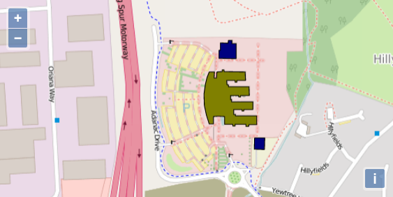

# Styler les couches vecteur

1.  Nous allons commencer avec un exemple fonctionnel qui affiche l'empreinte des bâtiments dans une couche vecteur.  Ouvrez votre éditeur de texte et sauvez ce qui suit dans `map.html` à la racine de votre répertoire `workshop`:

  ```html
  <!doctype html>
  <html lang="en">
    <head>
      <link rel="stylesheet" href="/ol.css" type="text/css">
      <style>
      #map {
        height: 256px;
        width: 512px;
      }
      </style>
      <title>OpenLayers 3 example</title>
      <script src="/loader.js" type="text/javascript"></script>
    </head>
    <body>
      <h1>My Map</h1>
      <div id="map"></div>
      <script type="text/javascript">
        var map = new ol.Map({
          target: 'map',
          layers: [
            new ol.layer.Tile({
              source: new ol.source.OSM()
            }),
            new ol.layer.Vector({
              title: 'Buildings',
              source: new ol.source.Vector({
                url: '/data/layers/buildings.kml',
                format: new ol.format.KML({
                  extractStyles: false
                })
              }),
              style: new ol.style.Style({
                stroke: new ol.style.Stroke({color: 'red', width: 2})
              })
            })
          ],
          view: new ol.View({
            center: ol.proj.fromLonLat([-122.79264450073244, 42.30975194250527]),
            zoom: 16
          })
        });
      </script>
    </body>
  </html>
  ```

2. Ouvrez le fichier `map.html` dans votre navigateur pour voir les bâtiments avec un contour rouge:  {{ book.workshopUrl }}/map.html

3. Avec une compréhension basique du [stylage dans OpenLayers](style-intro.md), nous pouvons créer une fonction de style qui affiche les bâtiments dans différentes couleurs en fonction de la taille de leur empreinte au sol. Dans votre code d'initialisation de la carte, ajoutez les deux tableaux de style suivants et remplacez l'option `style` pour la couche `'Buildings'` avec la fonction de style ci-dessous:

  ```js
    var defaultStyles = [
      new ol.style.Style({
        fill: new ol.style.Fill({color: 'navy'}),
        stroke: new ol.style.Stroke({color: 'black', width: 1})
      })
    ];
    var smallStyles = [
      new ol.style.Style({
        fill: new ol.style.Fill({color: 'olive'}),
        stroke: new ol.style.Stroke({color: 'black', width: 1})
      })
    ];

    function style(feature, resolution) {
      if (feature.get('shape_area') < 3000) {
        return smallStyles;
      } else {
        return defaultStyles;
      }
    }
  ```

4. Sauvez vos changements et ouvrez `map.html` dans votre navigateur: {{ book.workshopUrl }}/map.html

    

5. Maintenant comme étape finale, ajoutons une étiquette aux bâtiments. Par simplicité, nous allons seulement utiliser une étiquette et un contour noir comme styles.

  ```js
    style: (function() {
      var stroke = new ol.style.Stroke({
        color: 'black'
      });
      var textStroke = new ol.style.Stroke({
        color: '#fff',
        width: 3
      });
      var textFill = new ol.style.Fill({
        color: '#000'
      });
      return function(feature, resolution) {
        return [new ol.style.Style({
          stroke: stroke,
          text: new ol.style.Text({
            font: '12px Calibri,sans-serif',
            text: feature.get('key'),
            fill: textFill,
            stroke: textStroke
          })
        })];
      };
    })()
  ```

6. Sauvez vos changements et ouvrez `map.html` dans votre navigateur: {{ book.workshopUrl }}/map.html

  
