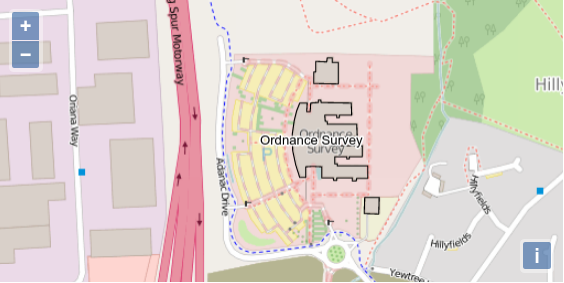

# Styling Vector Layers

1.  We'll start with a working example that displays building footprints in a vector layer.  Open your text editor and save the following as `map.html` in the root of your workshop directory:

  ```html
  <!doctype html>
  <html lang="en">
    <head>
      <meta charset="UTF-8">
      <link rel="stylesheet" href="libs/ol.css" type="text/css">
      <style>
      #map {
        height: 256px;
        width: 512px;
      }
      </style>
      <title>OpenLayers 3 example</title>
      <script src="libs/ol.js" type="text/javascript"></script>
    </head>
    <body>
      <h1>My Map</h1>
      <div id="map"></div>
      <script type="text/javascript">
        var map = new ol.Map({
          target: 'map',
          layers: [
            new ol.layer.Tile({
              source: new ol.source.OSM()
            }),
            new ol.layer.Vector({
              title: 'Buildings',
              source: new ol.source.Vector({
                url: '../data/layers/ordnance-survey-buildings.kml',
                format: new ol.format.KML({
                  extractStyles: false
                })
              }),
              style: new ol.style.Style({
                stroke: new ol.style.Stroke({color: 'red', width: 2})
              })
            })
          ],
          view: new ol.View({
            center: ol.proj.fromLonLat([-1.47126, 50.93812]),
            zoom: 16
          })
        });
      </script>
    </body>
  </html>
  ```

1. Open this `map.html` file in your browser to see buildings with a red outline:  {{ book.workshopUrl }}/map.html

1. With a basic understanding of [styling in OpenLayers](style-intro.md), we can create a style function that displays buildings in different colors based on the size of their footprint. In your map initialization code, add the following two styles arrays and replace the `style` option for the `'Buildings'` layer with the style function below:

  ```js
    var defaultStyles = [
      new ol.style.Style({
        fill: new ol.style.Fill({color: 'navy'}),
        stroke: new ol.style.Stroke({color: 'black', width: 1})
      })
    ];
    var smallStyles = [
      new ol.style.Style({
        fill: new ol.style.Fill({color: 'olive'}),
        stroke: new ol.style.Stroke({color: 'black', width: 1})
      })
    ];

    function style(feature, resolution) {
      if (feature.get('shape_area') < 3000) {
        return smallStyles;
      } else {
        return defaultStyles;
      }      
    }
  ```

1. Save your changes and open `map.html` in your browser: {{ book.workshopUrl }}/map.html

    

1. Now as a final step, let's add a label to the buildings. For simplicity we're only using a label and a black outline as the style.

  ```js
    style: (function() {
      var stroke = new ol.style.Stroke({
        color: 'black'
      });
      var textStroke = new ol.style.Stroke({
        color: '#fff',
        width: 3
      });
      var textFill = new ol.style.Fill({
        color: '#000'
      });
      return function(feature, resolution) {
        return [new ol.style.Style({
          stroke: stroke,
          text: new ol.style.Text({
            font: '12px Calibri,sans-serif',
            text: feature.get('name'),
            fill: textFill,
            stroke: textStroke
          })
        })];
      };
    })()
  ```

1. Save your changes and open `map.html` in your browser: {{ book.workshopUrl }}/map.html

  
